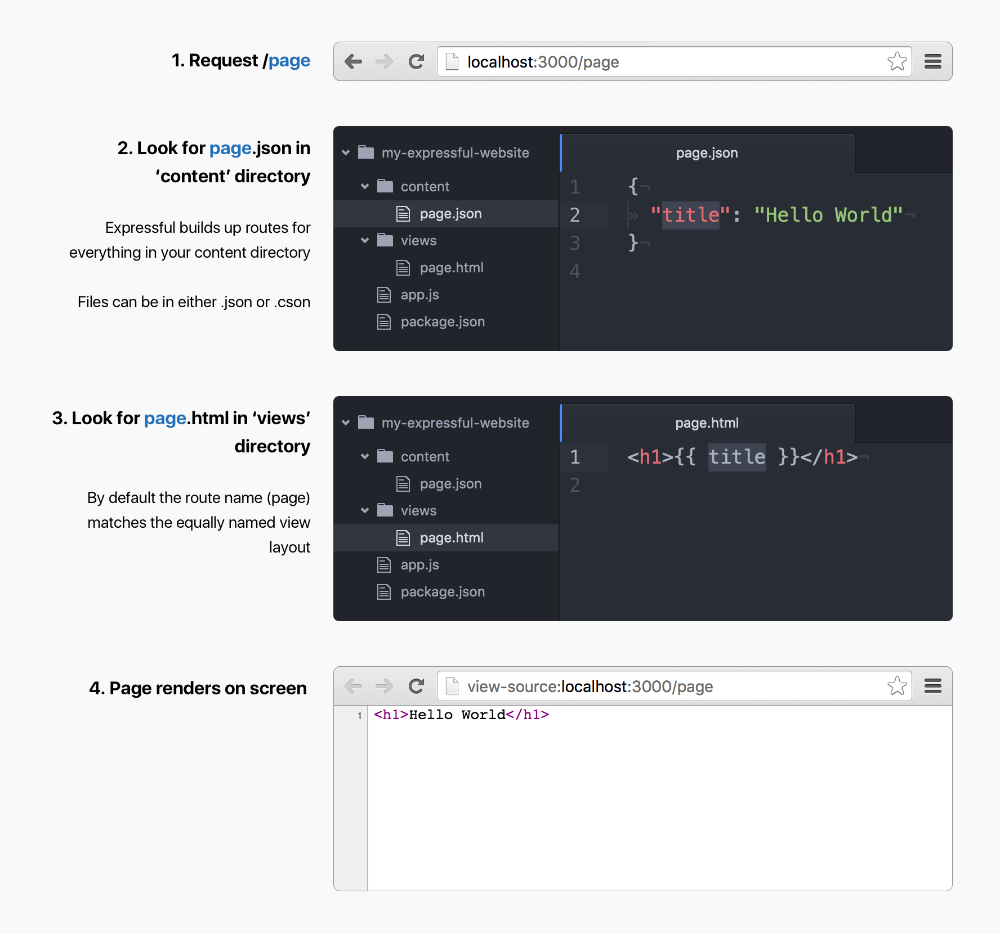

# Expressful
> Essential web technologies in one package.

**Currently in development**

```
$ npm install expressful --save
```

## Quick start

Expressful sets up a [Node.js](https://nodejs.org/en/) web server for the rest of us.

```javascript
// app.js
const app = require('expressful');
app.serveContent();
app.start();
```

Expressful is a tiny wrapper around the most popular Node.js web framework [Express.js](expressjs.com), loved by many.

Read the [total beginner guide on how to run an Expressful app](docs/total-beginner-guide.md)

## Is Expressful right for me?

You want to make [**branding websites**](docs/what-is-a-branding-website.md).
So you learn **HTML**, **CSS**, and maybe **JavaScript**.

Soon you get overwhelmed by technologies such as [Node.js](https://nodejs.org/en/), [Express.js](http://expressjs.com/), build tools such as [gulp](http://gulpjs.com/)) and CSS processors such as [CSS Next](http://cssnext.io/) to name a few.

Although essential, these tools have steep learning curves.

Expressful brings you these essential web technologies in one package.

Expressful gets out of your way. You focus on **content**, **design** and **publishing** your website.

### Websites that you should build with Expressful

* **App landing pages**
* **Small business websites**
* **Portfolio's**

### Goals of Expressful

* Remove setup time
* Easy for beginners
* Focus on content and design
* Focus on HTML and CSS
* Favors convention over configuration
* Keep your `package.json` dependencies list lean

## A simple project structure

Expressful is focused on **content**, **HTML** and **CSS**.
Most of your projects will look somewhat like this:

```
.
|-- /node_modules/        # contains dependencies such as expressful
|-- /public/              # contains assets such as images and fonts
|-- /css/                 # contains css files
|-- /content              # contains json and cson content files
|   |-- /about.json     
|   └-- /index.cson
|-- /views/               # contains html files
|   |-- /about.html
|   └-- /index.html
|-- /app.js               # starting point of your node app
└-- /package.json         # information about your app and dependencies
```

### Content directory

Expressful is based on a Content First design approach.
Start by putting your text in [cson](https://github.com/bevry/cson) or json files in your content directory.

Each file represents a page on your actual website.

## Basic content routing example



### Nunjucks templating

Expressful uses the [nunjucks](https://mozilla.github.io/nunjucks/templating.html) templating engine by default.

It's setup with `Remarkable` and `highlight.js` which makes it easy to write content in [Markdown](https://github.com/adam-p/markdown-here/wiki/Markdown-Cheatsheet)

### Expressful sets up Express.js with useful defaults

The Expressful `app` is just an Express.js app with useful defaults.
Calling `expressful()` sets up a `express` app for you with those useful defaults.

```javascript
const expressful = require('expressful');
const app = expressful();
```

1. sets up static directory for `/public`
2. mutes favicon request by default
3. sets up `nunjucks` templating (with `Remarkable` and `highlight.js`)
4. sets up the following modules
  * `body-parser`
  * `compression`
  * `errorhandler`
  * `morgan`
  * `serve-favicon`
  * `errorhandler`

**Note:** `multer`, `cookie-parser` and `express-session` are not in here

## API Reference

Expressful is a tiny wrapper around Express.js.
It offers some extra functions that make it even easier to work with:

* [app.start()](docs/app.start.md)
* [app.serveContent()](docs/app.serveContent.md)

## Configuration

Expressful is focused on convention over configuration.
However, there is some configuration available:

```javascript
const expressful = require('expressful');

// Values are defaults
const app = expressful({
  publicDirectory: 'public', // 'public' is the default static folder
  viewsDirectory: 'views', // don't change this for no reason, used for testing mainly
  faviconPath: 'public/favicon.ico', // path to favicon
  muteFavicon: true, // make it easy to get started without a favicon
  useNunjucks: true, // nunjucks is the default templating engine
  staticMaxAge: '30 days' // Caching time for static resources
});
```

## Author & License

Created by **Jeroen Ransijn** under the **MIT license**.
