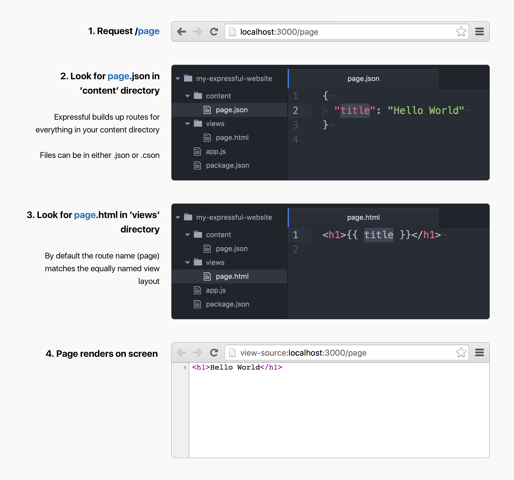

# Content routes

Expressful uses [expressful-content](https://github.com/jeroenransijn/expressful-content) under the hood to give your content files superpowers.

## Basic Routing Example



* **By default / routes to homepage**
* **Filenames that start with an underscore (_) will not be routed**

By default the route name is used for both `content` and `view`

```
GET /page MATCHES

  CONTENT FILE: ./content/page.json

    { title: 'Page' }

  LAYOUT FILE: ./views/page.html

    <h1>{{ title }}</h1>

OUTPUTS => <h1>Page</h1>
```

You can have routes with slashes. It will look for nested content.

```
GET /deep/page MATCHES

  CONTENT FILE: ./content/deep/page.json

    { title: 'Nested Page' }

  LAYOUT FILE: ./views/deep/page.html

    <h1>{{ title }}</h1>

OUTPUTS => <h1>Nested Page</h1>
```

Double underscores in filenames are considered (fake) slashes.
Overwrite what view to render with the `$layout` property

```
GET /blog/2016/10/06/article-title MATCHES

  CONTENT FILE: ./content/blog/2016__10__06__article.cson

    { $layout: 'blogpost.html', title: 'Article' }

  LAYOUT FILE: ./views/blogpost.html

    <h1>{{ title }}</h1>

OUTPUTS => <h1>Article</h1>
```

If there is content but no view, `next()` is called

### Basic homepage example with `__extend` content mixin

Assume the following project structure

```
.
|-- /content/
|   └-- /index.cson
|-- /views/
|   └-- /index.html
```

```cson
# ./content/index.cson

__extend: '_global.cson'
title: 'index'
```

```cson
# ./content/_global.cson

brandName: 'Expressful'
```

```html
<!-- ./views/index.html -->
<h1>{{ brandName }} - {{ title }}</h1>
```

`GET /` renders:

```html
<h1>Expressful - Homepage</h1>
```

### Blog example with `$layout` and `__list` content mixin

Assume the following project structure

```
.
|-- /content/
|   |   /blog.cson
|   └-- /blog/
|       |-- 2016__10__06__first-article.cson
|       └-- 2016__10__07__second-article.cson
|-- /views/
|   |   /blog.html
|   └-- /blogpost.html
```

#### Articles use `$layout` to set the layout

```
# ./content/blog/2016__10__06__first-article.cson
$layout: 'blogpost.html'
title: 'First'
```

```
# ./content/blog/2016__10__07__second-article.cson
$layout: 'blogpost.html'
title: 'Second'
```

```html
<!-- ./views/blogpost.html -->
<h1>{{ title }}</h1>
```

`GET /blog/2016/10/07/second-article` renders:

```html
<h1>Second</h1>
```

#### The overview itself uses `__list`

`__list` is a mixin that is somehwat harder to use.
It lists a directory and replaces the key `__list` by whatever is given in the `as` property.

[See an example about how `__list` works](https://github.com/jeroenransijn/expressful-content)

```blog.cson
title: 'Blog'
__list:
  directory: './blog',
  as: 'posts'
```

```blog.html

<h1>post.title</h1>

```

`GET /blog` renders:

```html
<!-- TODO: figure out if this is actually the order -->
<h1>First</h1>
<h1>Second</h1>
```
